# TCBV1

Textbook of Changing Ballance by Virtools (1)

## Foreword

TCBV can be acknowledged as a set of textbooks, which could teach Ballance players to change Ballance maps or configurations by Virtools. TCBV based on wide knowledge of using Virtools and appropriate distribution, is suitable for cartographers at different stages.

## Book Foreword

This book is mainly about basic understanding of operating Ballance maps by Virtools. This book needs cartographers to understand Ballance mapping and get some useful idea.

Written by:
* GE_Fang 
* BallanceBug

Based on tutorials by:
* Nice_Melodies
* jxpxxzj
* Chris_Xiong

Translated by:
* BallanceBug
* GE_Fang

*(Translations may not be 100% accurate!)*

## Content

* [Registration in Virtools](##Registration)
* [User Interface](##User Interface)
* [Importing/Exporting the Map File](##Importing/Exporting the Map File)
* [Some Basic Operations](##Some Basic Operations)
* [Camera View](##Camera View)
* [A Brief Summary of Objects](##A Brief Summary of Objects)

## Registration

Of all the versions of Virtools™ that are currently available, only two versions, 3.0 and 3.5, can be used to edit ballance maps. So please check you version first. 

A file named “devr.exe” can be found in the folder that virtools is installed. You need to register when you open virtools for the first time. (But if you cannot start it, please change the compatibility of it to **Windows XP (Service Pack 3) in settings, and run it as an administrator)**

Two options can be found when you are registering. Choose the second option **“specify the licence file”** , click “next”, then select the license file. The license file is included in the folder in which virtools is installed. After that, click “Next”, and the registration is finished. 

## User Interface

When you want to learn about editing the maps in Ballance by using Virtools, the first thing you need to get used to is the user interface of virtools. We'll use the interface of Virtools 3.0 as an example to analyze for you. (And we'll abbreviate “Virtools” to “VT” in later chapters)

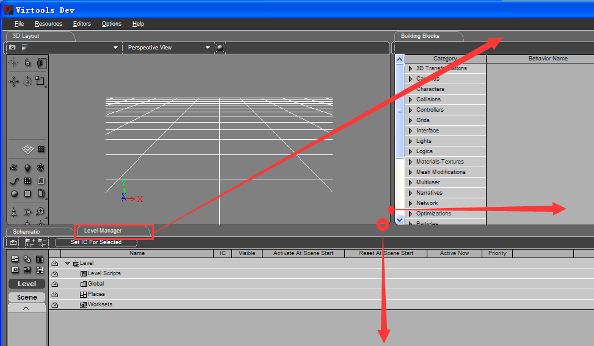

The frame of 3D Layout might be too small to use when you first open Virtools, so let's drag the border on the right and bottom of it to make it larger and easier to use. There are lots of objects in Level Manager, and Building Blocks on the right is almost useless for mapping, so to make it more easier, you can drag the frame of Level Manager to upper right corner, and below is what we'll see after that:

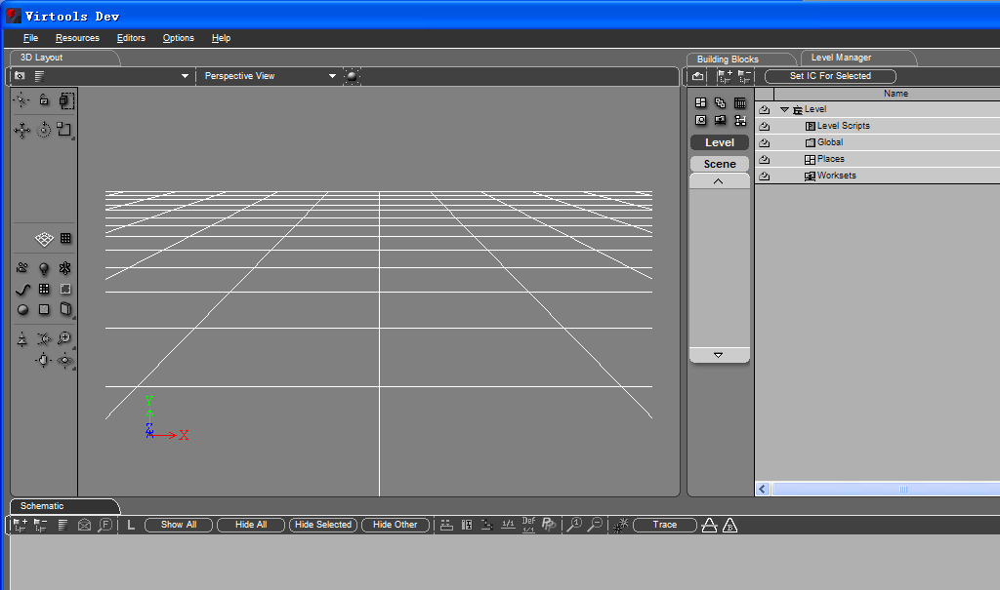

## Importing/Exporting the Map File

It's obvious that the format of map files in Ballance is NMO, but the “Load” option only allows you to open CMO files. NMO files can also be loaded, but only as a source file to be imported. 

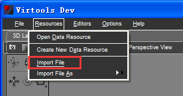

In fact, NMO map files of Ballance is actually CMO files that pretend to be NMO files. (further research shows that, as CMO supports not only map files but also animations, NMO files are the best format for static objects to be storaged) But, changing the extension name to CMO can bring you a lot of advantages. Thus it's recommended to edit and save your file as the CMO format, and change it only when you need to load it in the game.

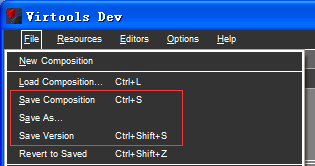

There are three ways to save files as CMO format: Save Composition, Save As…, and Save Version. Save Composition saves the file by replacing the original file which you loaded. Save As... allows you to save the file as another names.

But, the Save Version option is rather special. It saves the file as a different name, therefore the original file will not be replaced. 

For instance, if you loaded a file named “2HAD.cmo” and edited it, using Save Version can save you a file named “2HAD_01.cmo”, but the original file is left unsaved, as the image below shows: 

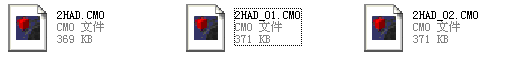

Map files can also be exported directly as the NMO format. This requires you to right click on “Level” in Level Manager, and click “Save As…”, as this image shows: 

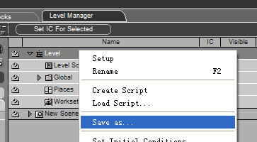

Sometimes we'll encounter another kind of NMO files, which contain only a few objects. These files are neither map files nor special configuration files. These are called sources, which are useful for mapping. To import sources to your map, the method in paragraph 1 in this chapter should be used. But it's a bit difficult to learn about importing/exporting source files, therefore, it won't be talked about in details until the next textbook.

## Some Basic Operations

We will use the changed interface on section 2 to introduce the details of this section. There exists an inconvenient detail that you need to adjust the same interface every time when opening Virtools. However, it doesn’t matter mapping, we adjust interface for the convenience. Let’s see the interface which has imported a map:

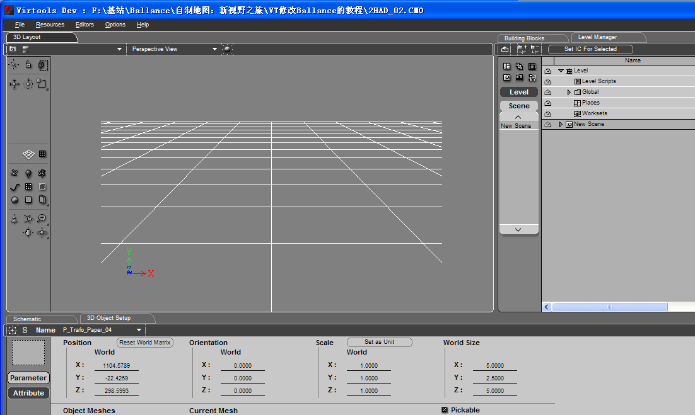

Emmm…You can’t see any objects! But it isn’t a mistake. When opening Virtools every time, your location will be moved to the center of the virtual world on 3D Layout. However, not all the maps are located in the center. To find objects, you need to have a series of location-change operation. The icons on the left could be understood as a toolbar. Let’s analyze the usage of some common icons.

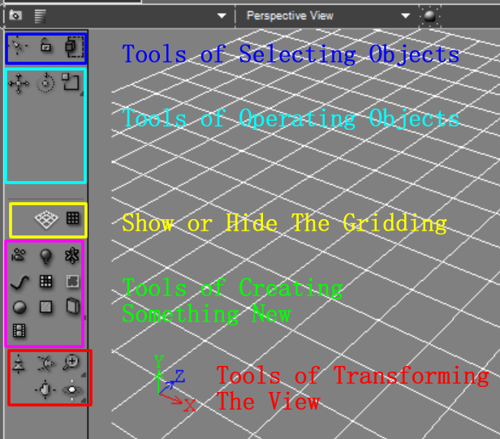

The following is a detailed description of some icons:

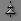 ：When selecting this icon, you could expand or shrink the view of 3D Layout by holding down the mouse. Totally speaking, you could find objects soon by this tool when editing unknown maps.

 and 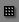 ：If you feel the default gridding is in the way of mapping, you could use them to show or hide the gridding of Virtools.

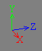 ：Coordinates, it represents the three vertical directions in the virtual space，so it is the basis of object-locating. 

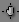 ：When selecting this icon, you could move the view by dragging the mouse.

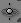 ：Adjust View by Surround: When you select nothing, you could surround view with the center of the virtual world. This adjustment is not commonly used, because the camera will run wild. You could select one or several objects and drag the mouse, then, the camera will surround your selection. Try holding down  , and you will see three selections: 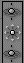 Drag the mouse on 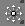 and loosen,   become  . Then you could use it to rotate the camera’s direction directly.

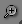 ：Forward and Backward Moving View: Like , but if you holding down the mouse and change it to 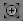 , you will move the view to just enough space for the selected object(s) after selecting object(s) and click. (We'll learn how to select objects next). This tool is useful.

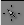 ：Select Object(s): Click object to select one object and drag mouse to select all objects in the selected area. You could hold down the key ”Ctrl” and click objects to select several specified objects. 

You should keep the mouse on the selected object(s) to use object-operating tools, if not, it will break your selection, even lead to some false operations. Suggest you click 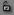 to lock your selection, and you could click any location of 3D Layout to operate selected object(s).

By the way, when you want to drag the mouse to select objects, you need to understand the following thing:

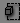 means that the selection box can select any object which has involved a part of the selection box, so the selection is easy to cause mistake choice. Therefore, suggest you click it and change it to 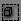 .Then, only the object(s) completely involved in the selection box can be selected. You could click  after selection to check if there exists a mistake choice.
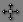 ：Move Object(s): After selecting object(s), you could select a coordinate or a flat considered by two coordinates. Then you could move selected object(s) based on the selected coordinate or flat. Such as the following picture, after selecting flat Z+X, you can only move selected object(s) on the flat Z+X, and the objects cannot be moved on coordinate Y.

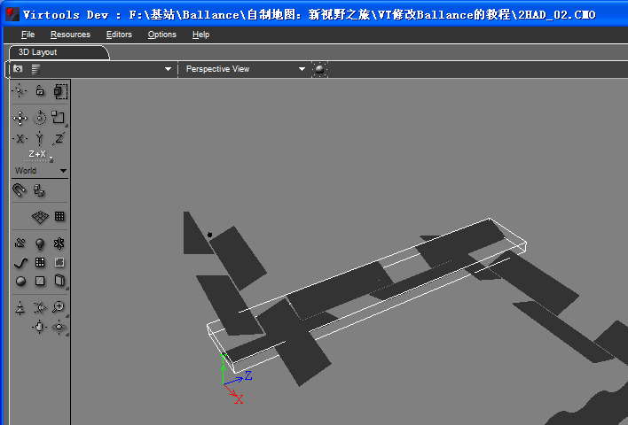

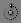 ：Rotate Object(s): Like moving object(s), You could select basic coordinate or flat to rotate. However, it is a bit hard to determine the selected basis. In fact, object(s) rotating is not commonly used, later, we will learn how to rotate an object accurately by adjusting the object setup. 

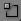 ：Expand or Shrink Object(s). This tool is not commonly used in Ballance mapping, and using it may contribute to some problems. 

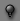 ：Place a point light (like a light bulb) in front of the view. You could use it to light the map. After all, point lights aren’t the inherent things in the original maps, and a map included point lights may cause some bad-visual influence. Therefore, you should delete point lights after mapping. (The point light is only one kind of lights, we will learn more about lights in the future) 

## Camera View

We have learnt a number of the operating icons. The other icons have little influence on Ballance mapping, so we don’t have an introduction of them. If you are interested in them, you could explore them by yourself.

You could learn how to adjust the camera view in this section. You could select camera mode by right-click the 3D Layout. You could also find the mode” * View” on the 3D Layout and click to select the camera mode. It’s shown in the picture below:

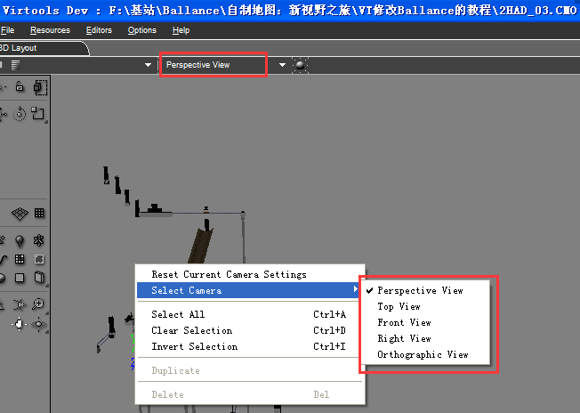
 
The default view is Perspective View, which is the most common view of maps.

---
Translating...